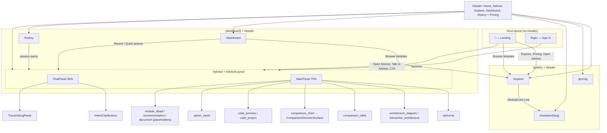

# UI Design — AI Tech Aggregator (Frontend)

This document describes the **entire user interface** of the application as implemented in the Next.js frontend (`frontend/`). It covers global styling, layouts, navigation, every route/page, interactive elements (buttons, links, inputs), advisor panels, the chat BFF route, a visual sitemap, and supporting libraries.

**Source of truth:** `frontend/src/app/**`, `frontend/src/components/**`, `frontend/src/stores/**`, `frontend/src/app/globals.css`.

---

## Visual sitemap (Mermaid)



**Reading the diagram**

- **Landing** and **Login** sit under the root layout only (no shared `Header`).
- **Explore, Pricing, module detail** share `PublicLayout` → `Header`.
- **Dashboard, History, Advisor** share `DashboardLayout` → `Header`; **Advisor** adds the 30/70 split below the header.
- **MainPanel** switches between panel types driven by SSE `panel_command` events (via `panelStore`).

---

## 1. Technology stack (UI-related)

| Item | Version / choice |
|------|------------------|
| Framework | Next.js 16 (App Router) |
| React | 19 |
| Styling | **Tailwind CSS v4** (`@import "tailwindcss"` in CSS; no separate `tailwind.config.ts` in repo) |
| Global CSS variables | `@theme inline` in `globals.css` |
| State | Zustand (`chatStore`, `panelStore`, `themeStore`, `visualIdentityStore`) |
| Architecture graph | `@xyflow/react` (canvas, stage groups, node drawer) |
| Auth UI | NextAuth (`signIn` on login page) |
| Markdown in chat | `react-markdown` + `remark-gfm` |
| Class names | `clsx` (chat bubbles) |
| Charts | Recharts (radar / bar comparison charts) |
| Syntax highlighting | Shiki (`codeToHtml`, theme `github-dark`) |
| Icons | Inline SVG in `Header`; `lucide-react` is a dependency (available for future use) |

---

## 2. Global CSS & theming (`src/app/globals.css`)

### 2.1 CSS variables (`:root`)

Semantic tokens in `globals.css` (light/dark via `themeStore` + `data-theme` on `<html>`):

| Variable | Role |
|----------|------|
| `--background`, `--foreground` | Page text/background |
| `--surface-panel`, `--surface-hover` | Advisor panel chrome |
| `--border-subtle` | Dividers |
| `--text-muted` | Secondary copy |
| `--accent` | Primary actions / links |

`ThemeProvider` runs `THEME_INIT_SCRIPT` before paint to avoid flash.

### 2.2 Tailwind

- Tailwind v4: `@import "tailwindcss"` in `globals.css`
- Advisor panels use `bg-[var(--surface-panel)]` and related arbitrary properties

### 2.3 Root layout (`src/app/layout.tsx`)

- `ThemeProvider` wraps children
- `min-h-screen bg-background text-foreground antialiased`

---

## 3. Application structure & navigation

### 3.1 Route map

| Path | Route group | Layout | Description |
|------|-------------|--------|-------------|
| `/` | *(root)* | Root only — **no `Header` component** | Marketing landing page with its own `<nav>` |
| `/explore` | `(public)` | `PublicLayout` + `Header` | Module catalog |
| `/pricing` | `(public)` | Same | Pricing tiers |
| `/modules/[slug]` | `(public)` | Same | Module detail |
| `/advisor` | `(dashboard)` | `DashboardLayout` + `Header` → nested `AdvisorLayout` | 30/70 advisor |
| `/dashboard` | `(dashboard)` | `DashboardLayout` + `Header` | Stats & recent sessions |
| `/history` | `(dashboard)` | Same | Paginated conversation list |
| `/login` | *(root)* | Root only — **no `Header`** | Email/password sign-in |

### 3.2 Shared header (`src/components/shared/Header.tsx`)

**Container**

- `border-b border-gray-200 dark:border-gray-800`
- Inner row: `flex h-16 items-center justify-between px-6`

**Brand**

- `Link` → `/` — `text-lg font-bold` — text: **AI Tech Aggregator**

**Desktop nav** (`hidden md:flex`, `gap-6`)

| Link | `href` | Classes |
|------|--------|---------|
| Advisor | `/advisor` | `text-sm text-gray-600 hover:text-gray-900 dark:text-gray-400 dark:hover:text-gray-100` |
| Explore | `/explore` | Same |
| Dashboard | `/dashboard` | Same |
| History | `/history` | Same |

**Right cluster**

- **Pricing** — `Link` `/pricing`: hidden on small screens (`hidden md:block`), same gray link styles.
- **`ThemeToggle`** — light / dark / system (`components/shared/ThemeToggle.tsx`)
- **Avatar placeholder** — `hidden h-8 w-8 rounded-full bg-gray-200 md:block dark:bg-gray-700` (TODO: real user avatar).
- **Mobile menu toggle** — `button`, `md:hidden`, `aria-label="Toggle menu"`:
  - `inline-flex items-center justify-center rounded-md p-2 text-gray-600 hover:bg-gray-100 hover:text-gray-900 dark:text-gray-400 dark:hover:bg-gray-800 dark:hover:text-gray-100`
  - Icon: Heroicons-style hamburger or X (SVG `stroke`).

**Mobile menu** (when open)

- `border-t border-gray-200 px-6 py-4 md:hidden dark:border-gray-800`
- Column `gap-3`: same links as desktop + Pricing; each closes menu on click.

**Note:** There is **no `/login` link** in `Header` today; login is only reachable by direct URL unless linked elsewhere.

### 3.3 Layout wrappers

- **`PublicLayout`** / **`DashboardLayout`**: identical structure — `flex min-h-screen flex-col`, `Header`, then `flex-1` for children.
- **`AdvisorLayout`** (`advisor/layout.tsx`): **no second header inside** — uses full viewport below header: `flex h-[calc(100vh-64px)] overflow-hidden` (64px = header height).

### 3.4 Landing page navigation (independent of `Header`)

`/` uses a custom top bar:

- `nav`: `flex items-center justify-between px-8 py-4`
- Title: `span` **AI Tech Aggregator** — `text-lg font-bold` (not a link)
- Links: Explore, Pricing — gray text links + dark variants
- **Open Advisor** — `Link` `/advisor`: `rounded-lg bg-blue-600 px-4 py-2 text-sm font-medium text-white hover:bg-blue-700`

Landing **does not** show Dashboard, History, or Login in the nav.

---

## 4. Design language (recurring patterns)

### 4.1 Primary actions (CTAs)

- Filled blue: `bg-blue-600 text-white hover:bg-blue-700` (+ optional `rounded-lg`, `px-4 py-2` or `px-8 py-3`, `font-semibold` / `font-medium`)

### 4.2 Secondary actions

- Outline: `border border-gray-300 ... hover:bg-gray-50 dark:border-gray-700 dark:hover:bg-gray-800` (or `gray-900` on landing hero second button)

### 4.3 Text hierarchy

- Page titles: `text-3xl font-bold` or `text-4xl font-bold`
- Section titles: `text-2xl font-bold` or `text-xl font-semibold`
- Muted copy: `text-gray-600 dark:text-gray-400` or `text-gray-500`

### 4.4 Cards & surfaces

- Bordered cards: `rounded-lg border border-gray-200 ... dark:border-gray-800` (often `p-4`, `p-6`, or `p-8`)
- Elevated / highlighted: `border-2 border-blue-600 shadow-lg` (pricing Pro tier)

### 4.5 Status badges (modules)

- **stable**: `bg-green-100 text-green-800 dark:bg-green-900/30 dark:text-green-400`
- **emerging**: `bg-yellow-100 text-yellow-800 dark:bg-yellow-900/30 dark:text-yellow-400`
- **experimental** (Explore only): `bg-purple-100 text-purple-800 dark:bg-purple-900/30 dark:text-purple-400`
- Default fallback: gray badge classes

### 4.6 Error states

- Red box: `rounded-lg border border-red-200 bg-red-50 p-6 text-red-700 dark:border-red-900 dark:bg-red-950 dark:text-red-400`

### 4.7 Loading / skeleton

- `animate-pulse` blocks with `bg-gray-100`, `bg-gray-200`, or `dark:bg-gray-800` / `dark:bg-gray-900`

### 4.8 Focus states (forms)

- Inputs often use: `focus:border-blue-500 focus:outline-none` and sometimes `focus:ring-2 focus:ring-blue-500/20` (login)

---

## 5. Page-by-page UI inventory

### 5.1 Landing (`src/app/page.tsx`)

**Sections**

1. **Top nav** — See §3.4.
2. **Hero** — Centered `pt-24 pb-16 px-8`:
   - `h1`: `text-5xl sm:text-6xl font-bold tracking-tight`; accent span `text-blue-600`
   - Subtitle: `text-lg text-gray-600 dark:text-gray-400`
   - Buttons row: **Talk to Advisor** (primary large), **Browse Modules** (secondary large)
3. **Categories** — `bg-gray-50 dark:bg-gray-900/50 py-16 px-8`:
   - Heading: `text-2xl font-bold text-center`
   - Grid: `grid gap-4 sm:grid-cols-2 lg:grid-cols-3`
   - Each cell: emoji + name + “N modules” — `border rounded-lg bg-white dark:bg-gray-900`
4. **Features (“How It Works”)** — `py-16 px-8`, `md:grid-cols-2`, bordered cards
5. **CTA band** — `bg-blue-600 py-16 px-8 text-center text-white`:
   - Subtext `text-blue-100`
   - Button: **Get Started Free** — white pill `bg-white text-blue-600 hover:bg-blue-50`
6. **Footer** — `border-t py-8 px-8`: brand + links Explore, Pricing, Advisor

**Data note:** Category counts/icons are **hardcoded** in `CATEGORIES` (marketing); live counts come from API on Explore.

---

### 5.2 Explore (`src/app/(public)/explore/page.tsx`)

**Layout:** `main.min-h-screen p-8`, inner `max-w-6xl mx-auto`.

**Elements**

- **Title:** `text-3xl font-bold`
- **Subtitle:** dynamic counts + `text-gray-600 dark:text-gray-400`
- **Search input:** `type="text"`, placeholder “Search modules…”
  - `flex-1 rounded-lg border border-gray-300 bg-white px-4 py-2 text-sm focus:border-blue-500 focus:outline-none dark:border-gray-700 dark:bg-gray-900`
- **Category filter pills:** `flex flex-wrap gap-2`
  - **All** button + one button per API category
  - Selected: `bg-blue-600 text-white`
  - Unselected: `bg-gray-100 text-gray-700 hover:bg-gray-200 dark:bg-gray-800 dark:text-gray-300`
  - Toggle: clicking same category clears filter
- **Loading:** 6 skeleton cards `h-40 animate-pulse rounded-lg border`
- **Error:** red alert box + hint with `apiBase` URL
- **Empty:** bordered centered “No modules found”
- **Grid:** `grid gap-6 md:grid-cols-2 lg:grid-cols-3`

**Module card** (`ModuleCard` — implemented as inner component)

- Whole card is `Link` → `/modules/{slug}`
- `group flex flex-col rounded-lg border p-6 transition-all hover:border-blue-300 hover:shadow-md dark:hover:border-blue-700`
- Title: `group-hover:text-blue-600 dark:group-hover:text-blue-400`
- Status pill (see §4.5)
- Footer chips: category slug (humanized), pricing label via `PRICING_LABELS` (Open Source, Freemium, etc.)

**API:** `GET {NEXT_PUBLIC_API_URL}/modules/categories` and `GET .../modules?...` (no auth headers).

---

### 5.3 Pricing (`src/app/(public)/pricing/page.tsx`)

- `main.min-h-screen p-8`, `max-w-6xl`
- Heading: `text-4xl font-bold text-center`
- Grid: `grid gap-8 lg:grid-cols-4` (four tiers: Free, Pro, Team, API)

**Per tier card**

- Pro (highlighted): `border-2 border-blue-600 shadow-lg` + “Most Popular” pill: `rounded-full bg-blue-100 px-3 py-1 text-xs font-medium text-blue-800 dark:bg-blue-900/30 dark:text-blue-400`
- Others: `border border-gray-200 dark:border-gray-800`
- Price: `text-3xl font-bold` + period in `text-gray-500`
- Features: list with green check `&#10003;` in `text-green-500`
- **CTA `Link`:** filled blue if highlighted, else bordered secondary (same pattern as elsewhere)

**Footer note:** gray text + **Talk to us** link `text-blue-600 hover:underline` → `/advisor`

---

### 5.4 Module detail (`src/app/(public)/modules/[slug]/page.tsx`)

**Layout:** `main.min-h-screen p-8`, `max-w-4xl`

**Navigation**

- **Back to Explore:** `Link` with `← Back to Explore` — `text-sm text-blue-600 hover:underline`

**Loading / error**

- Skeleton blocks for title + paragraphs
- Error: red box + back link

**Header block**

- `h1` module name, tagline, status badge (stable/emerging/default grays), version `text-xs text-gray-500`
- Meta badges: `rounded bg-gray-100 px-2 py-1 text-xs` (category, subcategory, license); pricing `bg-blue-100 text-blue-800` (dark variants)
- External links: Website, Documentation, GitHub — `text-sm text-blue-600 hover:underline`, `target="_blank"` `rel="noopener noreferrer"`

**Sections** (each with `h2` `text-xl font-semibold` where applicable)

- Overview — `whitespace-pre-line text-gray-700`
- Use cases (bullets with blue bullet) / Operations (mono chips)
- **Scores** — `ScoreBar`: gray track, blue fill width `score * 10%`, hover tooltip `absolute` dark tooltip box
- Knowledge — `<details>` / `<summary>` accordion styling
- Code examples — `CodeBlock` with header bar + **Copy** button + `pre` dark background
- Benchmarks — HTML `<table>` with bordered rows
- Related modules — Alternatives / Complements as `Link` cards
- Pipeline position — blue pill

---

### 5.5 Dashboard (`src/app/(dashboard)/dashboard/page.tsx`)

- `main p-8`, `max-w-6xl`
- **Stat cards** (`StatCard`): `rounded-lg border p-4`; label `text-sm text-gray-500`; value `text-2xl font-bold`; optional `text-blue-600` for tier
- **Quick Actions** — three `Link`s:
  - New Conversation — primary blue
  - Browse Modules / View History — bordered secondary
- **Recent conversations:** list of `Link` cards to `/advisor?session={id}` with hover border blue

**API:** `Authorization: Bearer dev@example.com` on `/users/me` and `/sessions?limit=5`.

---

### 5.6 History (`src/app/(dashboard)/history/page.tsx`)

- `main p-8`, `max-w-4xl`
- List items: same card/link pattern as dashboard recents; extra metadata (tokens, relative date) and trailing `→`
- **Empty state:** bordered box + **Start Conversation** primary button
- **Pagination:** **Previous** / **Next** `button`s — `rounded border border-gray-300 px-3 py-1 text-sm disabled:opacity-50 dark:border-gray-700` + “Page X of Y”

---

### 5.7 Login (`src/app/login/page.tsx`)

- Full viewport center: `flex min-h-screen items-center justify-center bg-gray-50 px-4 dark:bg-gray-950`
- Card: `max-w-md w-full rounded-2xl border bg-white p-8 shadow-lg dark:border-gray-800 dark:bg-gray-900`
- Title + subtitle
- Error banner: `bg-red-50 text-red-700 dark:bg-red-900/30 dark:text-red-400`
- **Form:** labeled Email + Password inputs (full width, rounded, focus ring)
- **Submit:** `w-full rounded-lg bg-blue-600 ... disabled:opacity-50` — text toggles “Signing in…” / “Sign In”
- Footer: “Sign up” `a href="#"` placeholder — `text-blue-600` (not implemented)

**Behavior:** NextAuth `signIn('credentials')`; success → `window.location.href = '/advisor'`.

---

### 5.8 Advisor (`src/app/(dashboard)/advisor/page.tsx` + components)

**Route:** `/advisor` optional query `?session=<uuid>` loads past messages from API.

**Suspense:** fallback `flex h-full items-center justify-center text-gray-400` — “Loading…”

**Split**

- **Left — `ChatPanel`** (~35%): `w-[35%] min-w-[320px]` + border using `--border-subtle`
- **Right — `MainPanel`** (~65%): `flex-1 flex-col overflow-hidden`

#### ChatPanel (`components/advisor/ChatPanel.tsx`)

- Scroll area: messages + streaming indicator (“Thinking…”)
- **`IntentClarification`** — chip buttons when backend sets `awaitingIntentClarification` (semantic intent)
- **`TraceDebugPanel`** — collapsible `advisor_trace` / `recommendation_explain` JSON; `EntityChip` for shortlist slugs
- **`ChatMessage`** + **`ChatInput`** at bottom

#### ChatMessage (`components/advisor/ChatMessage.tsx`)

- Row: user `justify-end`, assistant `justify-start`
- Bubble: `max-w-[85%] rounded-lg px-4 py-2 text-sm`
  - User: `bg-blue-600 text-white` + `whitespace-pre-wrap break-words`
  - Assistant: `bg-gray-100 text-gray-900 dark:bg-gray-800 dark:text-gray-100` + **Markdown** (GFM) with custom components:
    - Headings, lists, links (`text-blue-400 underline`), `code`/`pre` (dark code blocks), tables, blockquotes
- If `panelCommands` length > 0: footer line `text-xs text-gray-500` — “N panel update(s)”

#### ChatInput (`components/advisor/ChatInput.tsx`)

- Auto-resizing textarea; cycling placeholders; **Enter** send, **Shift+Enter** newline
- **Stop** control while streaming (abort `fetch`)
- Character hint when message length > 500
- Sends `{ message, session_id, client_context }` — constraints, panel snapshot, trace, option answers

**Network:** `POST /api/chat` (BFF) — **§12**.

#### MainPanel (`components/advisor/MainPanel.tsx`)

- When `currentPanel !== 'welcome'`: header bar `border-b px-6 py-3` with optional **back** chevron button (gray hover) and `panelTitle` as `h2`
- Content: `flex-1 overflow-y-auto`
- **Panel switch** (by `PanelType` from `types/chat.ts`):

| Panel type | Component / behavior |
|------------|----------------------|
| `welcome` | `WelcomePanel` — starter prompts |
| `architecture_diagram` | `ArchitectureDiagram` → `ArchitectureCanvas` (React Flow) |
| `interactive_architecture` | `InteractiveArchitecture` — canvas + optional bottom `CodeBlock` drawer |
| `comparison_table` | `ComparisonTable` — matrix + `EntityChip` |
| `comparison_chart` | `ComparisonChart` → **`ComparisonDecisionSurface`** |
| `code_preview` | `CodePreview` → `CodeBlock` (Shiki) |
| `code_project` | `CodeProject` — file tree + Shiki per file |
| `option_cards` | `OptionCards` — sends `option_answer` in `client_context` |
| `module_detail` | Placeholder |
| `recommendation` | Placeholder |
| `document` | Placeholder |
| default | `WelcomePanel` |

#### ComparisonDecisionSurface (`panels/comparison/`)

Orchestrates the primary comparison UX (panel type remains `comparison_chart` for API compatibility):

| Subcomponent | Role |
|--------------|------|
| `RecommendationHero` | Top pick, confidence, pipeline vs matrix divergence |
| `CapabilityComparisonBars` | Horizontal bars; dimensions emphasized from constraints |
| `TradeoffSpectrum` | Cost/perf and simplicity/scale sliders |
| `ExplainabilityDrawer` | Filters, scores, reasoning steps (internal filter reasons hidden) |
| `RadarAdvancedView` | Optional Recharts radar |
| `ComparisonTable` | Used when table-only data is needed |

Parsing/helpers: `frontend/src/lib/comparisonPanel.ts`, colors via `visualIdentityStore`.

#### Architecture canvas (`architecture/`)

| Component | Role |
|-----------|------|
| `ArchitectureCanvas` | React Flow graph, simple vs advanced view, focus dimming |
| `ArchModuleNode` / `ArchStageGroupNode` | Custom nodes; stage grouping from `architectureStages.ts` |
| `NodeDetailsDrawer` | Learn / Swap / Code → `sendMessage` with `client_context.architecture_node` |

Layout/payload: `architecturePayload.ts`, `architectureLayout.ts`, `architectureFocus.ts`, `architectureColors.ts`.

#### WelcomePanel (`panels/WelcomePanel.tsx`)

- Centered: `h2` “Welcome to AI Tech Advisor”, gray intro paragraph
- Four **suggestion buttons** (full-width cards): border, hover `hover:border-blue-300 hover:bg-blue-50` (+ dark variants), disabled while streaming; click calls `sendMessage(prompt)`

#### ComparisonTable (`panels/ComparisonTable.tsx`)

- Wide table: dimension rows × module columns
- Score cells: color by value (green ≥8, blue ≥6, red ≤4), mini progress bar, star for best-in-row
- Optional highlights grid + blue **Recommendation** box (same style as chart)

#### ComparisonChart (`panels/ComparisonChart.tsx`)

- Thin wrapper delegating to **`ComparisonDecisionSurface`** (see above). Legacy radar/bar paths may still exist in payload for advanced view toggle.

#### CodePreview (`panels/CodePreview.tsx`)

- Title “Code Preview”, optional filename line
- Toolbar: language label + **Copy** text button
- Body: Shiki HTML or fallback `pre`/`code`

---

## 6. State management (UI effects)

### 6.1 `chatStore` (`stores/chatStore.ts`)

- `messages`, `sessionId`, `isStreaming`, `abortController`
- Intent: `awaitingIntentClarification`, `intentAlternatives`, `resolvedIntentId`, `activePlaybookId`
- `constraintState`, `lastAdvisorTrace`, `lastRecommendationExplain`
- `sendMessage`, `sendClarificationChoice`, `resolveOutgoingConstraintState`
- SSE → `panelStore`; meta → constraint/trace state

### 6.2 `panelStore` (`stores/panelStore.ts`)

- `renderPanel` (`render` / `update` / `clear`), debounced render (~80ms)
- Architecture updates: `add_node`, `add_edge`, `highlight`
- `goBack`, `clearCodeDrawer`, `panelHistory`

### 6.3 `themeStore` + `visualIdentityStore`

- **Theme:** `light` | `dark` | `system` persisted in localStorage
- **Visual identity:** per-session palette; `EntityChip` and Recharts use stable entity colors

---

## 7. Environment & API wiring (UI-relevant)

| Variable | Use |
|----------|-----|
| `NEXT_PUBLIC_API_URL` | Defaults to `http://localhost:8000/api/v1` for Explore, module page, Dashboard, History |
| `BACKEND_URL` | Used **only** by the chat BFF (see §12); default `http://localhost:8000` (no `/api/v1` suffix) |
| Chat from advisor | Uses **relative** `fetch('/api/chat', …)` so the browser talks to the **same Next.js origin** |

---

## 8. Accessibility notes (as implemented)

- Header menu button has `aria-label="Toggle menu"`
- MainPanel back control has `aria-label="Go back"`
- Form labels on login page use `htmlFor` / `id`
- Many interactive cards are raw `button` or `Link` without extra ARIA descriptions

---

## 9. Known gaps / TODOs (from code comments)

- `Header.tsx`: “TODO: User avatar / sign in button”
- `MainPanel`: `module_detail`, `recommendation`, `document` are **placeholders**
- Login: “Sign up” link is `href="#"` (non-functional)
- Landing nav does not include Dashboard/History/Login (only Explore, Pricing, Advisor)
- No `/login` link in `Header`

---

## 10. File quick reference

| Concern | Path |
|---------|------|
| Global styles | `frontend/src/app/globals.css` |
| Root HTML shell | `frontend/src/app/layout.tsx` |
| Landing | `frontend/src/app/page.tsx` |
| Public shell | `frontend/src/app/(public)/layout.tsx` |
| Dashboard shell | `frontend/src/app/(dashboard)/layout.tsx` |
| Advisor split shell | `frontend/src/components/advisor/AdvisorLayout.tsx` |
| Top nav | `frontend/src/components/shared/Header.tsx` |
| Chat + panels | `frontend/src/components/advisor/*.tsx`, `panels/*.tsx`, `architecture/`, `panels/comparison/` |
| Stores | `frontend/src/stores/chatStore.ts`, `panelStore.ts`, `themeStore.ts`, `visualIdentityStore.ts` |
| Lib | `frontend/src/lib/comparisonPanel.ts`, `constraintState.ts`, `architecture*.ts` |
| Chat BFF | `frontend/src/app/api/chat/route.ts` |
| Tests | `frontend/src/__tests__/` |
| NextAuth | `frontend/src/app/api/auth/[...nextauth]/route.ts` |
| Types | `frontend/src/types/chat.ts`, `module.ts` |

---

## 12. Chat BFF — `frontend/src/app/api/chat/route.ts` (full reference)

This route is the **Backend-for-Frontend (BFF)** for the advisor chat. The browser calls **same-origin** `POST /api/chat`; Next.js forwards to FastAPI and **streams** the response back without buffering the SSE body.

### 12.1 Purpose

| Concern | Why |
|---------|-----|
| Same-origin fetch | Avoids CORS for SSE from the browser when the UI is on `localhost:3000` and API on `localhost:8000` |
| Stream passthrough | Forwards `text/event-stream` from backend to client |
| Auth forwarding | Copies `Authorization` from the incoming request (or dev default) to the backend |

### 12.2 Environment

| Symbol | Default | Meaning |
|--------|---------|---------|
| `process.env.BACKEND_URL` | `'http://localhost:8000'` | Origin of FastAPI **without** path prefix. The code appends `/api/v1/advisor/chat`. |

**Deploy note:** Set `BACKEND_URL` to your API host (e.g. `https://api.example.com`). Do not include a trailing slash requirement in code — the template literal is `` `${BACKEND_URL}/api/v1/advisor/chat` ``.

### 12.3 Exported handler

- **`export async function POST(request: NextRequest)`** — only **POST** is implemented; GET/OPTIONS are not defined in this file (Next will 405 for unsupported methods).

### 12.4 Line-by-line behavior

| Lines | What happens |
|-------|----------------|
| 1 | Import `NextRequest` from `next/server` for typed request access. |
| 3 | `BACKEND_URL` = env override or `http://localhost:8000`. |
| 5–6 | `POST` handler starts; `try` wraps all logic for unified error handling. |
| 7 | `await request.json()` — body `{ message, session_id?, client_context? }` (see `chatStore`). Invalid JSON → 500 catch. |
| 9–10 | Reads `authorization` header case-insensitively via `request.headers.get('authorization')`; if missing, uses **`Bearer dev@example.com`** (dev convenience; must be replaced for production auth). |
| 12–19 | `fetch` to **`${BACKEND_URL}/api/v1/advisor/chat`** with POST, `Content-Type: application/json`, `Authorization: authHeader`, and **same JSON body** stringified again. |
| 21–29 | If `!backendResponse.ok`: read body as **text**, return JSON error `{ error, details }` with **backend’s HTTP status** and `Content-Type: application/json`. Client sees JSON, not SSE. |
| 32–39 | If backend has no `body` stream: return **502** JSON `{ error: 'No response body from backend' }`. |
| 42–48 | **Success path:** `return new Response(backendResponse.body, { status: 200, headers: { 'Content-Type': 'text/event-stream', 'Cache-Control': 'no-cache', Connection: 'keep-alive' } })` — **streams** the backend body through to the client. |
| 50–61 | `catch`: log `Chat BFF error`, return **500** JSON with `error: 'Internal server error'` and `message` from `Error` or `'Unknown error'`. |

### 12.5 Client contract (`chatStore`)

The store calls:

```http
POST /api/chat
Content-Type: application/json
Authorization: Bearer dev@example.com

{
  "message": "...",
  "session_id": null,
  "client_context": {
    "constraint_state": { "slots": {} },
    "current_panel": "comparison_chart",
    "option_answer": { "answer_id": "...", "answer_label": "..." }
  }
}
```

The BFF forwards that to FastAPI; the response stream is SSE (`data: {...}\n\n`).

### 12.6 Error scenarios summary

| Situation | HTTP status to browser | Body type |
|-----------|------------------------|-----------|
| Backend 4xx/5xx | Same as backend | JSON `{ error, details }` |
| Backend missing body | 502 | JSON |
| BFF exception (JSON parse, network, etc.) | 500 | JSON |
| Success | 200 | **SSE stream** (`text/event-stream`) |

### 12.7 Optional enhancement ideas (not implemented)

- Forward additional headers (e.g. `Cookie`, request ID).
- `OPTIONS` handler for CORS if this route were ever called cross-origin from another site.
- Validate body schema before proxying.
- Strip or replace dev default `Authorization` in production.

---

*Update this file when UI components, routes, or `route.ts` behavior change.*
